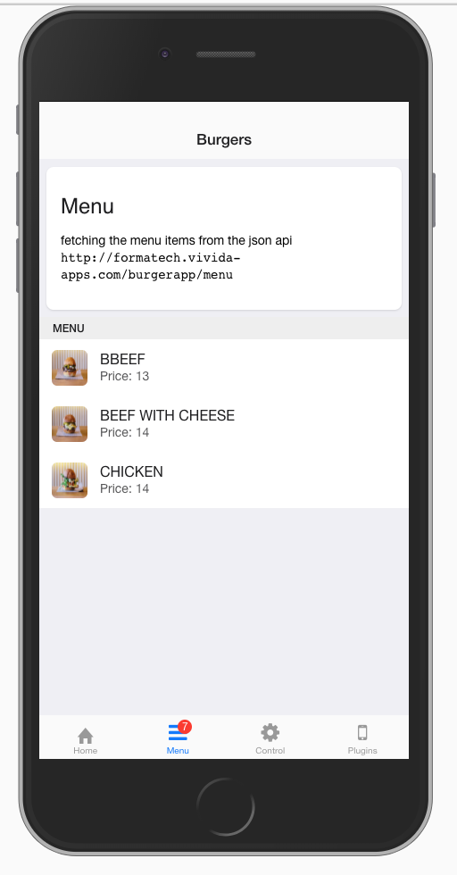

# PhoneGap Course


## Final App Preview


## Session 01 - Installing and Creating a new project

### Prerequisites:
 - Install NodeJs version 7 or above
 - Install phonegap-cli tool `npm i -g phonegap`

### Creating new application

```sh
# go to your home directory
cd c:\users\myuser\projects

# create new application
phonegap create burgerapp --id "com.formatech.burger" --name "Burger App"

# go into project directory
cd burgerapp
```

## Session 02 - Troubleshooting and Debugging the Application

### Useful commands (Command line/ terminal)

Command | Mac | Windows
--------|----|---
Change directory | cd | cd
List directory content | ls | dir
Create new directory | mkdir | mkdir
Remove directory | rm -rf <path> | del /f /s <path>
Remove file | rm file.txt | del file.txt
Show Current directory | pwd | cd

### Device Ready Event
Make sure to put the bootstrapping code inside **deviceready** event closure

```js
document.addEventListener('deviceready', function() {

    // your code here

}, false);
```

### Adding platforms

```sh
phonegap platform add android # to add android platform
phonegap platform add ios # to add ios platform
```


### Running the application

#### In the browser
```sh
phonegap serve # run the local server and open the browser to http://localhost:3000 by default
```

#### Using the PhoneGap app (you can find it on Play Store)


#### Running on device (or emulator)


```sh
phonegap run #run the application on all available targets and platforms
phonegap run android #run the application on android (all available targets)
phonegap run android --emulate #run the application on android using the emulator
phonegap run android --device #run the application on android using the plugged device
phonegap run ios #run the application on ios (all available targets)
phonegap run ios --emulate #run the application on ios using the emulator
phonegap run ios --device #run the application on ios using the plugged device emulator
```

### Show application run logs
add the `--verbose` flag to show the run log

### Debugging
Use the **Browser developer console**, and/or the LogCat from the **Android Device Monitor**


> **Note:** create a filter to filter out uneeded messages.

## Session 03 - Developing a custom user control using jQuery + Including OnsenUi
Developing a reusable user control (or component)

#### Global State
Define a global variable that should be shared across the app

```js
var session = {
    burgers: [
        {
            name: 'Cheese Burger',
            image: 'img/b1.jpg',
            price: 5000,
        },
        {
            name: 'Fish Burger',
            image: 'img/b2.jpg',
            price: 5500,
        },
    ],
}
```

> **Note:** off course you can put this variable inside a separate file, i.e. `session.js` but make sure to load this file before the `control` file

#### Create the control
create a separate file `list.control.js`

```js
document.addEventListener('init', function (event) {

    // usage: <list data-src="source" data-title="title"></list>
    $('list').each(function () {
        // do some logic for this control
    });

});
```

#### Use this control
inside your html

```html
    <!-- "burgers" and "kebbe" variable should be defined inside the session global state -->
    <list data-src="burgers" data-title="Burger Section"></list>
    <list data-src="kebbe" data-title="Lebanese Section"></list>
```

#### Include OnsenUi
Download the latest version from https://onsen.io and include the necessary files inside the `index.html` page, it should be similar to the below

> **Note:** Rename the downloaded folder to `onsen` so you can easily refer to it inside the html

```html
    <!-- cordova.js must be loaded first -->
    <script src="cordova.js"></script>
    <script src="js/jquery.min.js"></script>

    <!-- loading onseniu styles and js files -->
    <link rel="stylesheet" href="js/onsen/css/onsenui.min.css">
    <link rel="stylesheet" href="js/onsen/css/onsen-css-components.min.css">
    <script src="js/onsen/js/onsenui.min.js"></script>

    <!-- the main file for the app, where we have to put everything inside the `deviceready` event -->
    <script src="js/index.js"></script>
```

My file tree should be like this


## Session 04 - Calling json web api + using the OnsenUi list

we can use the jQuery `$.ajax` or some of it's alias like `$.get` and `$.post` to retrieve data from a remote endpoint.

```js
$.get('http://formatech.vivida-apps.com/burgerapp/menu', function (items) {

    // items is an array of item

    // iterate over the items and display them inside the html

})
```

#### OnsenUi list
check it on https://onsen.io/themeroller/#list

```html
<ons-list id="menu-list">

    <ons-list-header>Menu</ons-list-header>

    <ons-list-item>
        <div class="left">
            
        </div>
        <div class="center">
            <span class="list-item__title">Title</span>
            <span class="list-item__subtitle">Subtitle</span>
        </div>
    </ons-list-item>

</ons-list>
```



## Session 05 - PhoneGap plugins

### To list the installed plugins run

```sh
phonegap plugin list
```


### Adding a plugin

```sh
phonegap plugin add <plugin-id or url here>
```
Always read the plugin instructions before using it

### Removing a plugin
```sh
phonegap plugin remove <plugin-id>
```


### Battery Status
check https://cordova.apache.org/docs/en/latest/reference/cordova-plugin-battery-status/index.html for details about this plugin

```html
<div class="battery-status">
    <div class="battery-status-level"></div>
</div>
```

```js
function onBatteryStatus(status) {

    $('.battery-status-level').css('width', status.level + '%');

    if (status.isPlugged) {
        $('.battery-status-level').addClass('plugged')
    } else {
        $('.battery-status-level').removeClass('plugged')
    }

    console.log("Level: " + status.level + " isPlugged: " + status.isPlugged);
}

window.addEventListener("batterystatus", onBatteryStatus, false);
```

### Camera
check https://cordova.apache.org/docs/en/latest/reference/cordova-plugin-camera/index.html for details about this plugin

```html


<button id="openCamera" class="button">
    <ons-icon icon="fa-camera">
    </ons-icon>
    Open Camera
</button>
```

```js
function cameraSuccess(imageData) {
    $('.camera-image')
        .attr('src', "data:image/jpeg;base64," + imageData);
}

function cameraError(error) {
    console.log(error)
    alert('3a chu kheyif 🤢');
}

$('#openCamera').click(function () {
    navigator.camera.getPicture(cameraSuccess, cameraError, {
        quality: 20,
        destinationType: Camera.DestinationType.DATA_URL
    });

})
```